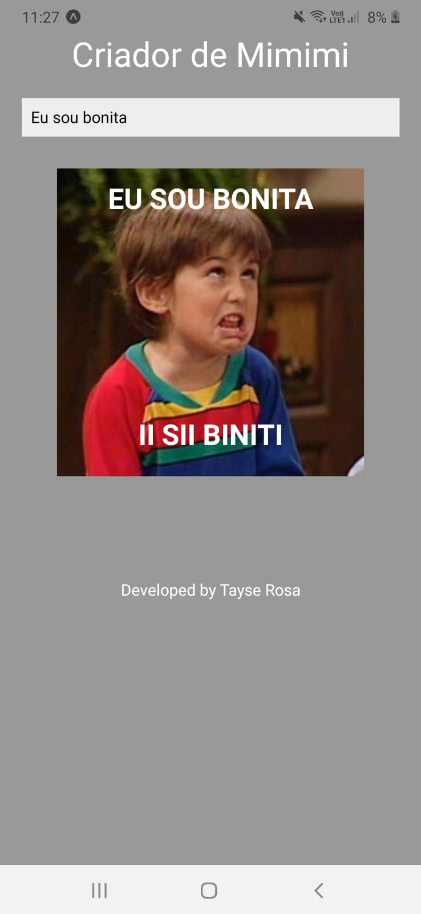

<h1 align="center">React Native - Projeto Criador de Memes </h1>

# Índice
- [Índice](#índice)
- [🛠 Sobre o Projeto RN - Criador de Memes](#-sobre-o-projeto-rn---criador-de-memes)
- [🚀 Tecnologias utilizadas neste projeto](#-tecnologias-utilizadas-neste-projeto)
- [📥 Como usar](#-como-usar)
- [🚀 Developer](#-developer)
- [📞 Contate a Dev](#-contate-a-dev)
  
---
# 🛠 Sobre o Projeto RN - Criador de Memes




# 🚀 Tecnologias utilizadas neste projeto
O projeto foi desenvolvido utilizando as seguintes tecnologias:

- [x] React Native
- [x] Javascript
- [x] StyleSheet


# 📥 Como usar
```js

    //Clonar o repositório
    $ git clone https://github.com/TayseRosa/rn-contador-agua.git

    //Entrar no diretório
    $ cd rn-contador-agua

    //Instalar dependências
    $ yarn install 

    //Startar o projeto
    $ yarn start
    

``` 

# 🚀 Developer

<a href="https://www.tayserosa.dev">
 
 <br />
 <sub><b>Tayse Rosa</b></sub></a> <a href="https://www.tayserosa.dev" title="Tayse Rosa">🚀</a>


Feito com ❤️ por Tayse Rosa 🚀

<hr />

# 📞 Contate a Dev

👋🏽 Entre em contato!


<a href="https://www.linkedin.com/in/tayse-rosa-3b683151/" target="_blank">

</a>
<br/>
<br/>

<a href="https://api.whatsapp.com/send?phone=5551982368077" target="_blank">

</a>
<br/>
<br/>


<a href="https://www.tayserosa.dev" target="_blank">

</a>
<br/>
<br/>

<a href="https://github.com/TayseRosa/" target="_blank">

</a>
<br/>
<br/>

<h5> Créditos: B7Web</h5>